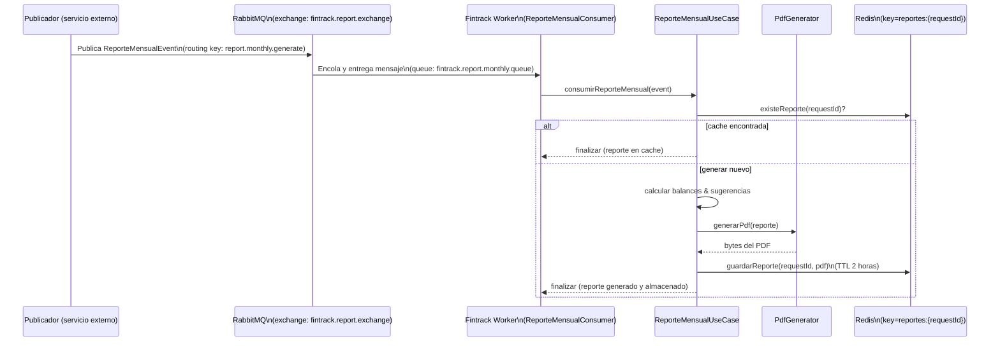

# FinTrack - Reports Worker

Este repositorio contiene el *worker* encargado de procesar eventos de reportes mensuales, generar PDFs y almacenar los resultados en Redis para su posterior recuperación. El componente está pensado para ejecutarse como una aplicación Spring Boot que consume mensajes desde RabbitMQ y expone métricas para Prometheus.

---

## Resumen

- Tipo: Worker (servicio backend sin endpoints HTTP REST propios, escucha mensajes de RabbitMQ).
- Entrada: mensajes de tipo `ReporteMensualEvent` publicados en RabbitMQ (exchange `fintrack.report.exchange`, routing key `report.monthly.generate`).
- Salida: PDF generado almacenado en Redis bajo la clave `reportes:{requestId}` con TTL (2 horas por implementación actual).
- Observabilidad: Spring Boot Actuator (`/actuator/health`, `/actuator/prometheus`), Prometheus y Grafana (opcional vía `docker-compose.yml`).

---

## Componentes principales

- Consumo y entrada de mensajes:
  - `src/main/java/com/example/fintrackreports/infrastructure/messaging/consumer/ReporteMensualConsumer.java`
- Casos de uso / lógica de negocio:
  - `src/main/java/com/example/fintrackreports/application/usecase/ReporteMensualUseCase.java`
- Generación de PDF:
  - Implementación con Apache PDFBox: `src/main/java/com/example/fintrackreports/infrastructure/pdf/generator/PdfGeneratorImpl.java`
  - Adaptador (puerto): `src/main/java/com/example/fintrackreports/infrastructure/pdf/adapter/ReportePdfAdapter.java`
- Cache en Redis:
  - Implementación: `src/main/java/com/example/fintrackreports/infrastructure/cache/RedisReportCache.java`
  - Configuración: `src/main/java/com/example/fintrackreports/infrastructure/config/RedisConfig.java`
- Configuración de RabbitMQ:
  - `src/main/java/com/example/fintrackreports/infrastructure/config/RabbitMQConfig.java`
- Archivo de configuración de la app:
  - `src/main/resources/application.yml`
- Docker / Observabilidad:
  - `docker-compose.yml` (Prometheus + Grafana)
  - `prometheus.yml` (scrape target)

---

## Flujo de procesamiento (secuencia)



---

## Diagrama de decisión / flujo (procesamiento)

```mermaid
flowchart TD
    A[Recibir evento ReporteMensualEvent] --> B{¿Existe en Redis?}
    B -- Sí --> C[Registrar "reporte ya en cache" \n y terminar]
    B -- No --> D[Calcular balances por categoría]
    D --> E[Generar sugerencias financieras]
    E --> F[Generar PDF (PDFBox)]
    F --> G[Guardar PDF en Redis \nclave: reportes:{requestId} (TTL 2h)]
    G --> H[Terminar]
```

---

## Pipeline de observabilidad

```mermaid
graph LR
  App[Fintrack Worker\n(port 8086)\n/actuator/prometheus] --> Prom[Prometheus\n(port 9090)]
  Prom --> Graf[Grafana\n(port 3000)]
```

---

## Tabla de endpoints y recursos usados

| Tipo | Nombre | Ruta / Valor | Puerto | Descripción |
|---|---:|---|---:|---|
| HTTP (Actuator) | Health | `/actuator/health` | 8086 | Endpoint de salud expuesto por Spring Boot Actuator |
| HTTP (Actuator) | Metrics (Prometheus) | `/actuator/prometheus` | 8086 | Métricas para Prometheus (scrape target) |
| RabbitMQ | Exchange | `fintrack.report.exchange` | — | Exchange usado para publicar eventos de reportes |
| RabbitMQ | Queue | `fintrack.report.monthly.queue` | — | Cola que consume el worker (binding con la exchange) |
| RabbitMQ | Routing key | `report.monthly.generate` | — | Routing key usada para enrutar mensajes al worker |
| Redis | Key prefix | `reportes:{requestId}` | 6379 | Clave donde se guarda el PDF generado (TTL: 2 horas en la implementación actual) |
| Docker Compose | Prometheus | `prom/prometheus` | 9090 | Servicio definido en `docker-compose.yml` |
| Docker Compose | Grafana | `grafana/grafana` | 3000 | Servicio definido en `docker-compose.yml` (admin/admin) |

> Nota: este proyecto no expone endpoints REST para crear reportes — funciona por mensajes (event-driven). Para pruebas, publica un `ReporteMensualEvent` en RabbitMQ.

---

## Ejemplo de payload (JSON) para `ReporteMensualEvent`

```json
{
  "requestId": "req-123",
  "emailUsuario": "usuario@example.com",
  "mes": 5,
  "anio": 2026,
  "egresos": [
    {
      "id": 1,
      "monto": 100.50,
      "fecha": "2026-05-10",
      "categoria": "ALIMENTACION",
      "descripcion": "Supermercado",
      "emailUsuario": "usuario@example.com"
    }
  ],
  "presupuestos": [
    {
      "fecha": "2026-05-01",
      "categoria": "ALIMENTACION",
      "monto": 300.00
    }
  ]
}
```

Campos disponibles (clases):
- `ReporteMensualEvent` — `requestId`, `emailUsuario`, `mes`, `anio`, `egresos[]`, `presupuestos[]`.
- `Egreso` — `id`, `monto`, `fecha`, `categoria` (enum), `descripcion`, `emailUsuario`.
- `PresupuestoMensual` — `fecha`, `categoria`, `monto`.

---

## Cómo publicar un mensaje de prueba en RabbitMQ

1. Usando `rabbitmqadmin` (instalar o usar el binario):

```bash
rabbitmqadmin publish exchange=fintrack.report.exchange \
  routing_key=report.monthly.generate \
  payload='{"requestId":"req-123","emailUsuario":"usuario@example.com","mes":5,"anio":2026,"egresos":[],"presupuestos":[]}'
```

2. Usando la API HTTP de management (si el plugin management está habilitado en RabbitMQ):

```bash
curl -u guest:guest -H "content-type:application/json" -X POST \
  -d '{"properties":{},"routing_key":"report.monthly.generate","payload":"{\"requestId\":\"req-123\",\"emailUsuario\":\"usuario@example.com\",\"mes\":5,\"anio\":2026,\"egresos\":[],\"presupuestos\":[]}","payload_encoding":"string"}' \
  http://localhost:15672/api/exchanges/%2F/fintrack.report.exchange/publish
```

3. Usando un pequeño script Python (pika):

```python
import pika, json

conn = pika.BlockingConnection(pika.ConnectionParameters('localhost'))
ch = conn.channel()
ch.exchange_declare(exchange='fintrack.report.exchange', exchange_type='topic', durable=True)
payload = {
  "requestId": "req-123",
  "emailUsuario": "usuario@example.com",
  "mes": 5,
  "anio": 2026,
  "egresos": [],
  "presupuestos": []
}
ch.basic_publish(exchange='fintrack.report.exchange', routing_key='report.monthly.generate', body=json.dumps(payload))
conn.close()
```

---

## Ejecución local (desarrollo)

Requisitos previos:
- Java 21
- Maven
- (Opcional) Docker / Docker Compose para Prometheus + Grafana

Construir:

```bash
mvn -DskipTests package
```

Ejecutar la aplicación:

```bash
# Desde el directorio raíz del proyecto
mvn spring-boot:run
# O ejecutar el jar resultante
java -jar target/fintrack-reports-worker-0.0.1-SNAPSHOT.jar
```

Ejecutar Prometheus + Grafana (opcional):

```bash
# Desde la raíz del proyecto (donde está docker-compose.yml)
docker compose up -d
```

- Prometheus accesible en: `http://localhost:9090`
- Grafana accesible en: `http://localhost:3000` (usuario: `admin`, contraseña: `admin` según `docker-compose.yml`)

> Observación: el `prometheus.yml` está configurado para hacer `scrape` a `host.docker.internal:8086` — esto permite que Prometheus en Docker scrapee la aplicación que se ejecuta en el host (puerto `8086` definido en `application.yml`).

---

## Configuración (variables y properties)

Revisa `src/main/resources/application.yml`. Variables principales:

- `spring.data.redis.host` (por defecto `localhost`)
- `spring.data.redis.port` (por defecto `6379`)
- `spring.data.redis.password` (por defecto vacío)
- `spring.rabbitmq.*` (host/port/username/password/virtual-host) — por defecto apunta a `localhost` y `guest`.
- `report.cache.ttl-hours` (valor en `application.yml`, la implementación actual usa TTL de 2 horas de forma estática)

---

## Archivos relevantes (rápido acceso)

- [DemoApplication.java](src/main/java/com/example/fintrackreports/DemoApplication.java)
- [ReporteMensualConsumer.java](src/main/java/com/example/fintrackreports/infrastructure/messaging/consumer/ReporteMensualConsumer.java)
- [ReporteMensualUseCase.java](src/main/java/com/example/fintrackreports/application/usecase/ReporteMensualUseCase.java)
- [ReportePdfAdapter.java](src/main/java/com/example/fintrackreports/infrastructure/pdf/adapter/ReportePdfAdapter.java)
- [PdfGeneratorImpl.java](src/main/java/com/example/fintrackreports/infrastructure/pdf/generator/PdfGeneratorImpl.java)
- [RedisReportCache.java](src/main/java/com/example/fintrackreports/infrastructure/cache/RedisReportCache.java)
- [RedisConfig.java](src/main/java/com/example/fintrackreports/infrastructure/config/RedisConfig.java)
- [RabbitMQConfig.java](src/main/java/com/example/fintrackreports/infrastructure/config/RabbitMQConfig.java)
- [application.yml](src/main/resources/application.yml)
- [docker-compose.yml](docker-compose.yml)
- [prometheus.yml](prometheus.yml)

---

## Troubleshooting rápido

- El worker no procesa mensajes:
  - Verifica que RabbitMQ esté accesible (`spring.rabbitmq.host`/`port`).
  - Confirma que la exchange/queue/routing key coincidan con los usados por el publicador.
  - Revisa logs de la app y de RabbitMQ.

- PDF no generado o error de PDFBox:
  - Revisa excepciones en logs; la generación lanza RuntimeException en errores.

- Redis no guarda los PDFs:
  - Verifica conexión a Redis (host/port/password).
  - Comprueba claves con `redis-cli keys "reportes:*"`.

---

Si quieres, puedo:
- Añadir un script de prueba para publicar mensajes automáticamente.
- Integrar un `docker-compose` que incluya RabbitMQ y Redis para pruebas locales completas.
- Generar dashboards básicos de Grafana para visualizar métricas.

---

*Documento generado automáticamente por el asistente de desarrollo.*
